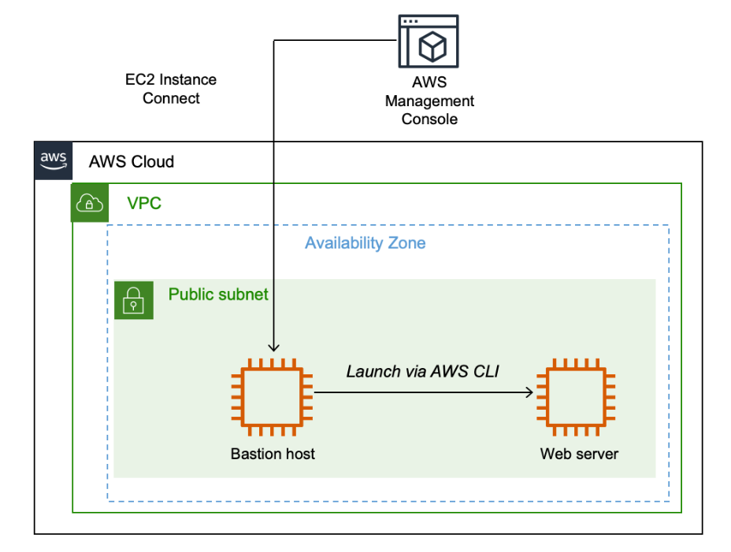

# Neste laboratório, você praticará o uso dos comandos da AWS Command Line Interface (AWS CLI) em uma instância do Amazon Elastic Compute Cloud (Amazon EC2) para:

## Criar um bucket do Amazon Simple Storage Service (Amazon S3).

Criar um novo usuário do AWS Identity and Access Management (IAM) que tenha acesso total ao serviço do Amazon S3.

Fazer upload de arquivos para o Amazon S3 para hospedar um site simples para a cafeteria e padaria.

Criar um arquivo em lote que possa ser usado para atualizar o site estático quando você alterar qualquer um dos arquivos do site localmente.

Conectar-se a uma Instância do Amazon Linux EC2 usando SSM

Utilize o Session Manager do AWS Systems Manager para se conectar à instância.

Altere o usuário e o diretório inicial.

Configurar a AWS CLI

Atualize a AWS CLI com credenciais utilizando o comando aws configure.

Criar um Bucket do S3 usando a AWS CLI

Utilize o comando aws s3api create-bucket para criar um bucket na região us-west-2.

Criar um Usuário do IAM com Acesso Total ao Amazon S3

Crie um usuário do IAM e configure um perfil de login.

Conceda acesso total ao Amazon S3 ao usuário criado.

Ajustar Permissões de Bucket do S3

Desbloqueie o acesso público e habilite ACLs nas configurações do bucket.

Extrair os Arquivos Necessários

Extraia o conteúdo do arquivo static-website-v2.tar.gz para o bucket do S3.

Fazer Upload de Arquivos para o Amazon S3

Utilize o comando aws s3 cp para fazer upload dos arquivos para o bucket com acesso público.

Criar um Arquivo em Lote para Atualização do Site

Crie um script em bash para tornar a atualização do site repetível e faça as modificações necessárias no arquivo index.html.
