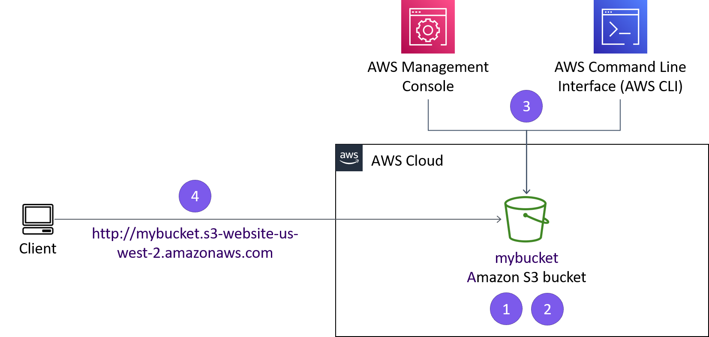

# Neste laboratório, você praticará o uso dos comandos da AWS Command Line Interface (AWS CLI) em uma instância do Amazon Elastic Compute Cloud (Amazon EC2) para:

## Criar um bucket do Amazon Simple Storage Service (Amazon S3).

Criar um novo usuário do AWS Identity and Access Management (IAM) que tenha acesso total ao serviço do Amazon S3.

Fazer upload de arquivos para o Amazon S3 para hospedar um site simples para a cafeteria e padaria.

Criar um arquivo em lote que possa ser usado para atualizar o site estático quando você alterar qualquer um dos arquivos do site localmente.

